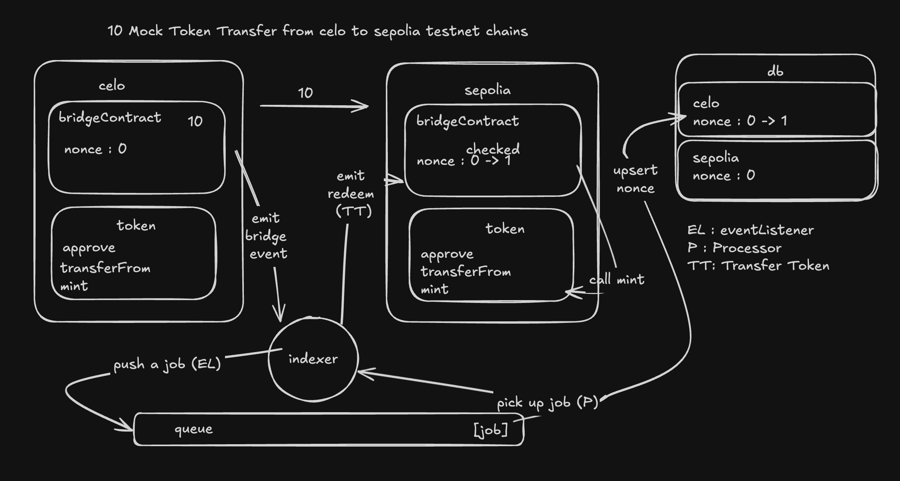

# Bridge  
Cross‑Chain ERC20 Token Bridge for EVM‑Compatible Blockchains

## 🚀 Demo  
Watch the demo video here: **[Demo Video](https://drive.google.com/file/d/1pMhOz7KKPfGs7erkoLwt8ex8jPrf1HyX/view?usp=drive_link)**



## 🧾 Overview  
This project implements a simple cross‐chain token bridge architecture with the following components:  
- On each chain, a **Bridge Contract** and an **ERC20 Token Contract** are deployed.  
- A Node.js/TypeScript indexer listens for “lock” events on the source chain, queues a job, stores a nonce in MongoDB, and triggers mint/release on the destination chain.  
- The architecture covers event listening, job‑queueing, nonce management (to prevent replays), and cross‐chain token movement.

## 📁 Repository Structure  
```
/contracts             # Smart contracts (Bridge + MockERC20)  
/indexer               # Node.js service: event listener, job queue, MongoDB nonce store  
/frontend              # Web UI for users to lock/mint tokens  
/public                # Static assets  
```

## 🔧 Key Components  
### Smart Contracts (`/contracts`)  
- **BridgeContract.sol** — handles locking tokens on the source chain, verifying nonces, minting/releasing on the other chain.  
- **MockERC20.sol** — a simple ERC20 token for testing.  
- Nonce‐based validation to defend against replay attacks and front‑running.

### Indexer Service (`/indexer`)  
- Listens to BridgeContract events (e.g., `Locked`, `Burned`) on one chain.  
- Pushes jobs into a job queue (e.g., using Bull or similar) for processing.  
- Stores and tracks nonces in MongoDB so that each cross‑chain transfer is processed exactly once.  
- Emits the corresponding transaction on the destination chain (mint/release).

### Web UI (`/frontend`)  
- A simple interface for users to select source/destination chains, enter amount, and initiate a cross‑chain transfer.

## ✅ Features  
- Multi‐chain support (EVM compatible).  
- On‑chain contracts + off‑chain relayer architecture.  
- Nonce tracking to avoid replay attacks.  
- Clear separation of concerns: UI, contracts, indexer.

## 🧪 Getting Started  
1. Clone the repository:  
   ```bash
   git clone https://github.com/Asif‑Ali‑13/Bridge.git
   cd Bridge
   ```  
2. Install dependencies for each module using `npm install` or `yarn`.  
3. Compile & deploy the smart contracts (via forge) to two EVM chains (e.g., Sepolia & Celo).  
4. Complete the configuration and fill the environment variables 
5. Run the indexer:  
   ```bash
   cd indexer
   npm run start
   ```  
6. Launch the frontend and connect to one chain via web3 provider (MetaMask) and test a cross‑chain lock/mint operation.

## 👥 Contributing  
Contributions are welcome! Feel free to open issues or pull requests. If you add features like multi‑signer relayers, event aggregation, or on‐chain verification, please document them.

## 📝 License  
This project is released under the MIT License.

## 📬 Contact  
Connect with me on :  
* [GitHub](https://github.com/Asif‑Ali‑13)  
* [LinkedIn](https://www.linkedin.com/in/asif-ali-267772285/)
